# R **seminar**

Videregående
Tue Hellstern

---
@title[Tidsplan]
## Tidsplan

|               |                 |
|---------------|-----------------|
|Velkommen      |Kl. 17:00        |
|Sandwich       |Kl. 18:15 - 18:45|
|Kaffe/The/Kage |Kl. 20:00 - 20:15|
|Spørgsmål      |Kl. 21:00        |
|Tak for i aften|Kl. 21:30        |

---
@title[Agenda]
## Agenda

@ol[...](false)
- RStudio
- Dataimport
- IF - ELSE - SWITCH
- LOOP
- Funktioner
- Linear Regression
- Shiny
@olend

---
@title[RStudio]
## RStudio

+++
@title[RStudui - IDE]

@snap[west span-50]
@box[bg-gold text-white rounded box-padding](RStudio er et IDE, Integreret Udviklingsmiljø der gør det nemmere at skrive din R kode)
@snapend

@snap[east span-50]
RStudio fåes i to *versioner:*
@ol[...](false)
- Desktop
- Cloud
@olend
@snapend

@snap[south-west span-50]
www.rstudio.com
@snapend

@snap[south-east span-50]
www.rstudio.cloud
@snapend

+++
@title[IDE - Brugerflade]


---
@title[Dataimport]
## Dataimport

+++
@title[Typer]

@ol[...](false)
- CSV
- Excel
- Databaser
- SPSS, SAS
- Web
- API – (Typisk via en Pakke)
- Clipboard
@olend

+++
@title[readxl]

@snap[north-west span-50 text-black]
**readxl** pakken er en del af tidyverse pakken  
**readxl** gør det nemt og hurtigt at importere data fra Excel
@snapend

@snap[south-west span-100 text-black]
```r zoom-10
install.packages("tidyverse")
install.packages("readxl")

library(readxl)

# Eksempel
read_excel("SeminarData.xlsx", sheet="height_weight")
```
@snapend

@snap[east span-100 text-blue text-10]
@[1-2, zoom-20](Installer enten tidyverse eller readxl)
@[4, zoom-20](Brug paken readxl)
@[7, zoom-12](Henter fra Excel SeminarData.xlsx, ark height_weight)
@snapend

+++
@title[Parameter]

@snap[north-west span-100 text-black]
readxl parameter
@snapend

@snap[west span-100 text-black]
```r zoom-10
read_excel(
  path,
  sheet = NULL,
  range = NULL,
  col_names = TRUE,
  col_types = NULL,
  na = "",
  trim_ws = TRUE,
  skip = 0,
  n_max = Inf,
  guess_max = min(1000, n_max),
  progress = readxl_progress(),
  .name_repair = "unique"
)
```
@snapend

@snap[east span-100 text-blue text-10]
@[2, zoom-20](Stil til Excel filen)
@[3, zoom-20](Kan være et navn eller index nummer)
@[5, zoom-20](Vil du have Overskrifter med)
@snapend

+++ ?code=code/API_StatistikbankenPitch.R&lang=r zoom-12
@title[API]

@snap[north-west span-100 text-05 text-black]
**API** står for Application Programming Interface, det er for betegner en ”funktion” inden for software, der gør det muligt for flere programmer at arbejder sammen.
@snapend

@snap[south-west span-100 text-blue text-10]
@[1-2, zoom-10](Aktiver pakker - statsDk og tidyverse)
@[4-5, zoom-10](Hent data - Bemærk 1980)
@[7-10, zoom-10](Groupering af data - sum på INDHOLD)
@[13-15, zoom-0](3 Plot, fordelt på HERKOMST )
@snapend

+++
@title[Clipboard]

@snap[north-west span-100 text-05 text-black]
Det er muligt at bruge **CRTL+C** og så hente fra **Clipboard**
@snapend

```r zoom-12
dataKlip <- readClipboard()

read.table(file="clipboard", sep ="t", header=TRUE)
```
---
@title[IF - ELSE - SWITCH]
## IF - ELSE - SWITCH
 
+++?color=white
@title[IF - ELSE]

@snap[west span-50 text-black]
Programmet tester en betingelse og udfører noget kode ud fra dette.
<br>
@ol[text-blue](false)
- if
- if..else
@olend
@snapend

@snap[east span-50]
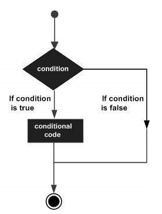
@snapend

+++
@title[IF]

@snap[north-west span-50 text-black]
IF
@snapend

@snap[west span-60 text-black]
```r zoom-15
x <- 3

if (x == 0) {
  print("X er ligmed 0")
}
```
@snapend

@snap[east span-40]
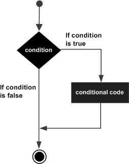
@snapend

+++
@title[IF..ELSE]

@snap[north-west span-50 text-black]
IF..ELSE
@snapend

@snap[west span-65 text-black]
```r zoom-12
x <- -1

if (x == 0) {
  print("X er ligmed 0")
} else {
  print("X er ikke 0")
}
```
@snapend

@snap[east span-35]
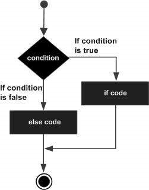
@snapend

+++
@title[IF..ELSE IF..ELSE ]

@snap[north-west span-50 text-black]
IF..ELSE IF..ELSE
@snapend

@snap[west span-65 text-black]
```r zoom-12
x <- -10

if (x == 0) {
  print("X er ligmed 0")
} else if (x > 0) {
  print("X er et positivt tal")
} else {
  print("X er et negativt tal")
}
```
@snapend

+++?color=white
@title[SWITCH]

@snap[north-west span-80 text-black]
En switch gør det muligt at teste en variabel testes op mod flere betingelser. Hver værdi kaldes en case og der kan udføres kode for hver case.
@snapend

@snap[south-west span-60 text-black text-07]
Der er nogle betingelser for en switch
@ol[text-blue](false)
- Din variabel skal være et tal, du kan ikke test op mod en string (tekst)
- Hvis der er mere end et match vil det være det første der bliver udført
- Det er ikke muligt at have en default case
@olend
@snapend

@snap[south-east span-35]
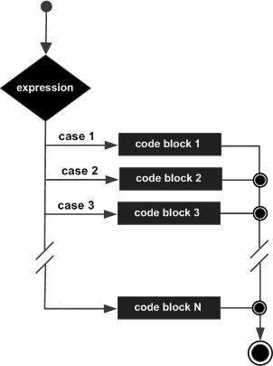
@snapend

+++
@title[SWITCH Eksempel]

@snap[north-west span-50 text-black]
SWITCH Eksempel
@snapend

@snap[west span-65 text-black]
```r zoom-12
UgeDagNr <- 2

UgeDagTekst <- switch(UgeDagNr,
                      "Mandag",
                      "Tirsdag",
                      "Onsdag",
                      "Torsdag",
                      "Fredag",
                      "Lørdag",
                      "Søndag"
                      )

UgeDagTekst
```
@snapend

---

@title[LOOP]
## LOOP
### repeat - while - for

+++
@title[repeat]

@snap[north-west span-60 text-black text-08]
Et **repeat loop** gentager den sammen kode indtil en stopbetingelse er nået.
Et **reapeat loop** vil altid blive afviklet mindst en gang.
@snapend

@snap[south-west span-70 text-black]
```r zoom-12
v <- c("Hello","loop")
cnt <- 2

repeat {
  print(v)
  cnt <- cnt+1
  
  if(cnt > 5) {
    break
  }
}
```
@snapend

@snap[east span-30]
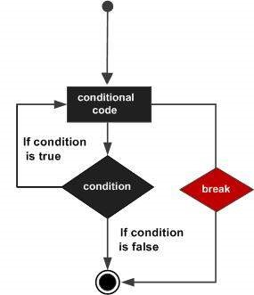
@snapend

+++
@title[while]

@snap[north-west span-70 text-black text-07]
Et **while loop** gentager den samme kode indtil en stopbetingelse er nået. Stopbetingelse bliver evalueret før udførslen af koden. 
Det *kan* betyde at et **while loop** aldrig bliver udført, hvis stopbetingelsen er opfyldt fra start.


@snap[south-west span-70 text-black]
```r zoom-15
v <- c("Hello","while loop")
cnt <- 2

while (cnt < 6) {
  print(v)
  cnt = cnt + 1
}
```
@snapend

@snap[east span-30]
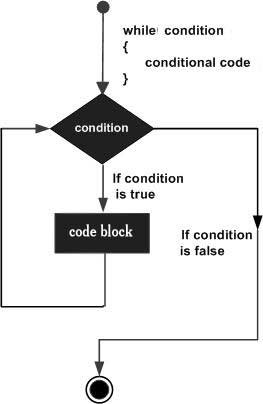
@snapend

+++
@title[for]

@snap[north-west span-70 text-black text-07]
I et **for loop** er det dig der bestemmer antallet af gennemløb. 
Et **for loop** er meget fleksibelt da det ikke nødvendigvis skal være tal, du brugere men det kan være *vectors*, list eller *charater*.
@snapend


@snap[south-west span-70 text-black]
```r zoom-18
v <- LETTERS[1:4]

for ( i in v) {
  print(i)
}
```
@snapend

@snap[east span-30]
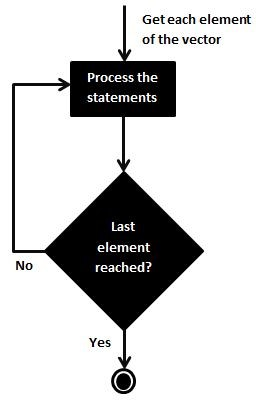
@snapend

+++
@title[LOOP Kontrol - break]

@snap[north-west span-70 text-black text-07]
Et **break** statement har to anvendelser:
@ol[text-blue](false)
- Hvis du vil stoppe et LOOP før det er færdigt
- Til at afslutte i en switch
@olend
@snapend

@snap[south-west span-70 text-black]
```r zoom-14
v <- c("Hello","loop")
cnt <- 2

repeat {
  print(v)
  cnt <- cnt + 1
  
  if(cnt > 5) {
    break
  }
}
```
@snapend

@snap[east span-30]

@snapend

+++
@title[LOOP Kontrol - next]

@snap[north-west span-70 text-black text-07]
Hvor break stopper udførelsen af et LOOP så kan du bruge **next** til at springe en iteration over i et LOOP. <br>
Dit LOOP fortsætter med den næste iteration i dit LOOP.
@snapend

@snap[south-west span-70 text-black]
```r zoom-14
v <- LETTERS[1:6]

for ( i in v) {
  
  if (i == "D") {
    next
  }
  print(i)
}
```
@snapend

@snap[east span-30]
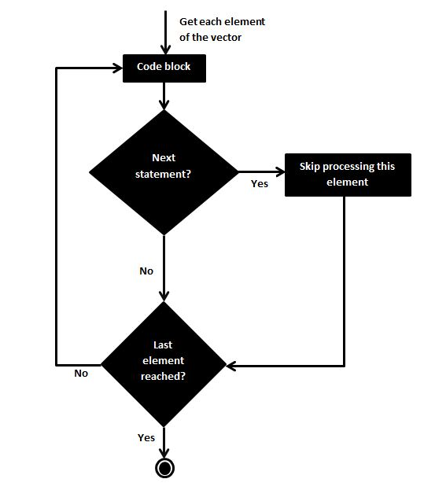
@snapend

---
@title[Funktioner]
## Funktioner
indbyggede - user defined

+++
@title[Indbyggede Funktioner]

@snap[north-west span-70 text-black text-07]
### R har rigtig mange indbyggede funktioner, f.eks.
@snapend

@ol[text-blue](false)
- abs()
- log()
- exp()
- sqrt()
- .....
@olend

+++?color=white
@title[User Defined Functions]

@snap[north-west span-70 text-07 text-black]
Du kan også oprette dine egne funktioner <br>
User Defined Functions – **UDF**
@snapend

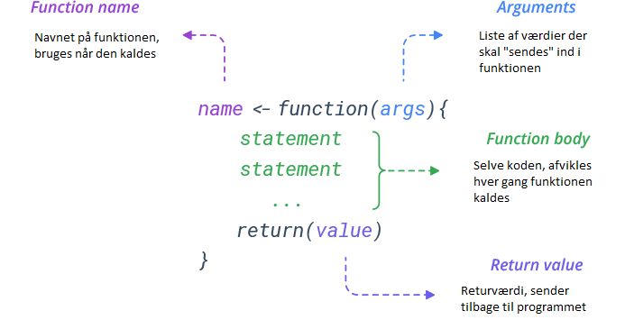

+++
@title[Funktions Eksempler]

@snap[north-west span-70 text-black text-07]
**2 eksempler på funktioner**
@snapend

@snap[east span-50]
```r zoom-07
PrimtalCheck <- function(x){
  if (x == 2) {
    resultat = "Tallet er et primtal"
  } else if (any(x %% 2:(x-1) == 0)) {
    resultat = "Tallet er IKKE et primtal"
  } else { 
    resultat = "Tallet er et primtal"
  }
  resultat
}

PrimtalCheck(2)
```
@snapend

@snap[west span-50]
```r zoom-07
UgeDagNr <- 2

UgeDagTekst <- function(UgeDagNr) {
  switch(UgeDagNr,
         "Mandag",
         "Tirsdag",
         "Onsdag",
         "Torsdag",
         "Fredag",
         "Lørdag",
         "Søndag")
}

UgeDagTekst(2) 
```
@snapend

---
@title[Linear Regression]
## Linear Regression

+++
@title[Linear Regression]

@snap[west span-70 text-07]
Regressionsanalyse er et meget brugt statistisk værktøj til at etablere en relationsmodel mellem to variabler. En af disse variabler kaldes ”predictor variable”.
Den anden variabel kaldes ”response variable”, hvis værdi er afledt af ”predictor variable”.
<br>
**Matematisk repræsenterer et lineært forhold en lige linje, når de bliver afbildet som en graf.**
@snapend

@snap[east span-30 text-07]
## y = ax + b
@snapend

+++?color=white
@title[Eksempel]

@snap[north-west span-100 text-07 text-black]
Et simpelt eksempel på en linear regresion kunne være det at forudsige en persons **vægt** ud fra personens **højde**. For at gøre dette skal du ”oprette” en **relation** mellem højden og vægten på personer.
<br>
@ol[text-blue](false)
- Indsamling af data – højde(height) og vægt(weight)
- Oprettelse af relationen mellem disse – **lm( )**
- Brug funktionen **predict()** til at forudsige vægten af en person
- Vis dit resultat grafisk
@olend
@snapend

@snap[south-west span-25]
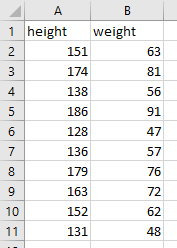
@snapend

@snap[south-east span-35]
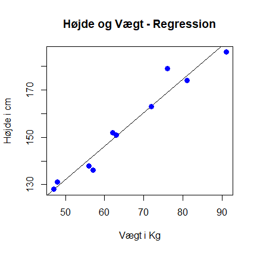
@snapend

+++ ?code=code/LRPitch.R&lang=r zoom-07
@title[Eksempel Kode]

@snap[north-east span-100 text-blue text-10]
@[1-2, zoom-15](Aktiver pakker)
@[4-5, zoom-12](Hent data - SeminarExcel.xlsx)
@[7-8, zoom-15](Opret **Relationen** mellem højde og vægt)
@[10-14, zoom-15](*Hvad vejer en person på 180 cm.?*)
@[16-23, zoom-15](Brug ggplot)
@snapend


---
@title[Shiny]
## Shiny

+++
@title[Kode eksempel]

@snap[north-west span-70 text-black text-07]
**Shiny kode eksempel**
@snapend

@snap[east span-55 text-black text-07]
ui.R
```r zoom-05
library(readxl)
library(ggplot2)
library(tidyverse)

salg <- read_excel("SalgsData.xlsx", sheet = "salgs_data")

# Use a fluid Bootstrap layout
fluidPage(    
    
    # Side overskrift
    titlePanel("Salg efter kundetype"),
    
    # Opret sidebar
    sidebarLayout(      
        
        # Sidebar Input
        sidebarPanel(helpText("Du har mulighed for at vælge, kun at se et bestemt land"), 
                     
                     selectInput("valgtland", h3("Vaelg land"), 
                                 choices = salg$Country, 
                                 selected = 1)),
        
        # Placering af barplot
        mainPanel(
            plotOutput("salgplot")  
        )
        
    )
)
```
@snapend

@snap[west span-45 text-black text-07]
server.R
```r zoom-05
library(readxl)
library(ggplot2)
library(tidyverse)
library(ggthemes)

salg <- read_excel("SalgsData.xlsx", sheet = "salgs_data")

# Input/Out-put Shiny app
function(input, output) {

  
  output$selected_var <- renderText({ 
    paste("Valg af land", input$valgtLand)
  })
    
  # Placering af plot
  output$salgplot <- renderPlot({
    
    # Opret barplot, inkl filter
    dplyr::filter(salg, Country == input$valgtland) %>%
      ggplot(aes(x=CompanyType, y=Total)) +
      geom_bar(stat="identity", fill="lightblue") + 
      ylab("Salg i Kr.") +
      xlab("Kundetyper") + 
      theme_economist()
  })
}
```
@snapend

@snap[south-east span-25]
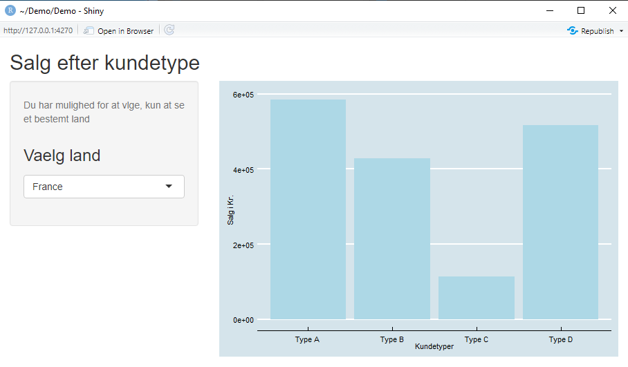
@snapend

---
@title[Opgaver]
@snap[north-west span-70 text-black text-07]
## Opgaver
@snapend
Her er nogle små opgaver som enten vil blive løst på seminaret, hvis der er tid, eller også kan du løse dem senere. 
<br><br>
Løsningen på disse opgaver er i de filer du har fået tilsendt.

+++?color=white
@title[Funktion – SUM to tal]
@snap[north-west span-70 text-black text-07]
Opret en funktion der summere to tal
Funktionsnavn: **MinSum**
@snapend

@snap[west span-50]

@snapend

+++?color=white
@title[Funktion – Division med 3]
@snap[north-west span-100 text-black text-07]
Opret en funktion der undersøger om et tal kan divideres med 3.

Funktionsnavn: **division3**
<br>
Returner følgende:
@ol[text-blue](false)
- Hvis det kan divideres med 3: **"Tallet kan divideres med 3"**
- Hvis det IKKE kan divideres med 3: **"Tallet kan IKKE divideres med 3"**
@olend

<br><br>
*Tip! – Brug x%%3==0*

@snapend

@snap[south-east span-70]
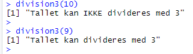
@snapend

+++?color=white
@title[Funktion – Rabat & Pris]
@snap[north-west span-100 text-black text-07]
Vi har en virksomhed der giver rabat i forhold til hvad du køber for:
<br>
|Beløb                                          |Rabat %  |
|-----------------------------------------------|---------|
|0 til og med 1.000                             |0% rabat |
|Over 1.000, men mindre end eller lig med 5.000 |10% rabat|
|Over 5.000                                     |20% rabat|
<br><br>
Du skal returnere både rabatprocenten og <br>prisen hvor rabatten er trukket fra
Funktionsnavn: **Rabat**
@snapend

@snap[south-east span-50]
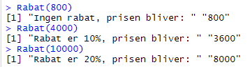
@snapend

+++?color=white
@title[Primtal]
@snap[north-west span-70 text-black text-07]
Du skal ”printe” alle primtal der er mindre end 50
<br>
*Et primtal er et positivt heltal større end 1, der ikke er deleligt med andre hele positive tal end 1 og tallet selv*
Resultat er: <br><br>**2, 3, 5, 7, 11, 13, 17, 19, 23, 29, 31, 37, 41, 43, 47**
@snapend

@snap[south-east span-25]
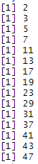
@snapend

+++?color=white
@title[Is salg]
@snap[north-west span-100 text-black text-07]
I Excel filen, **SeminarData.xlsx**, er der et ark med forholdet mellem **temperaturen** og **is salget**(omsætning) for to sommermåneder.
Du skal oprette en **relation** ved at bruge R funktionen **lm()** mellem *Temp* og *Salg*.
Denne relation skal du, sammen med R funktionen **predict()**, bruge til at forudsige hvad is salget vil være ved en temperatur på **24 grader**.
<br>**Resultat = 8.514,632**
@snapend

@snap[south-west span-33 text-black text-05]
Forholdet mellem Dato og salget på denne dato
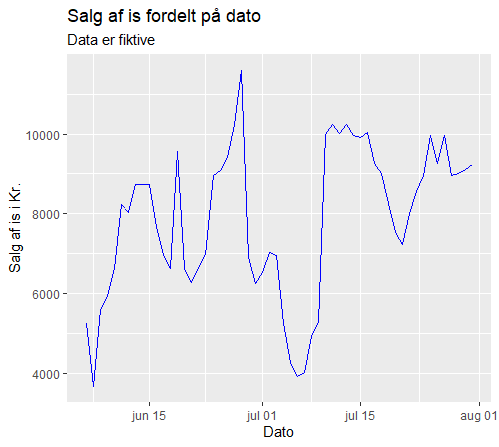
@snapend

@snap[south-east span-33 text-black text-05]
Forholdet mellem Temp og Salg
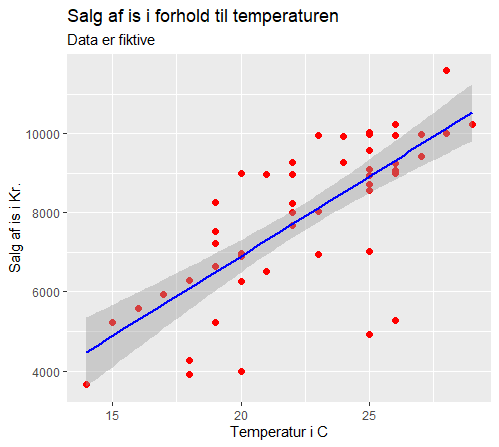
@snapend