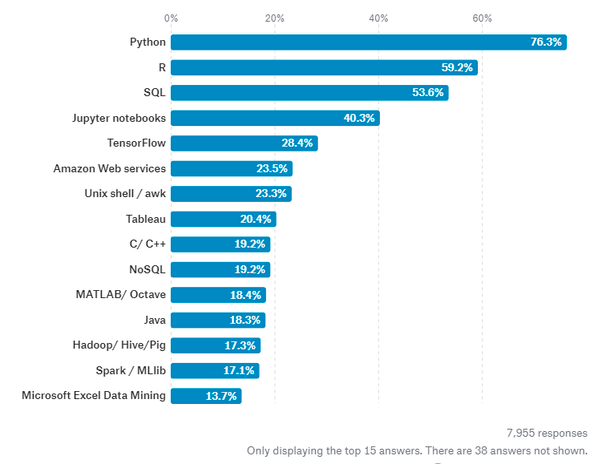
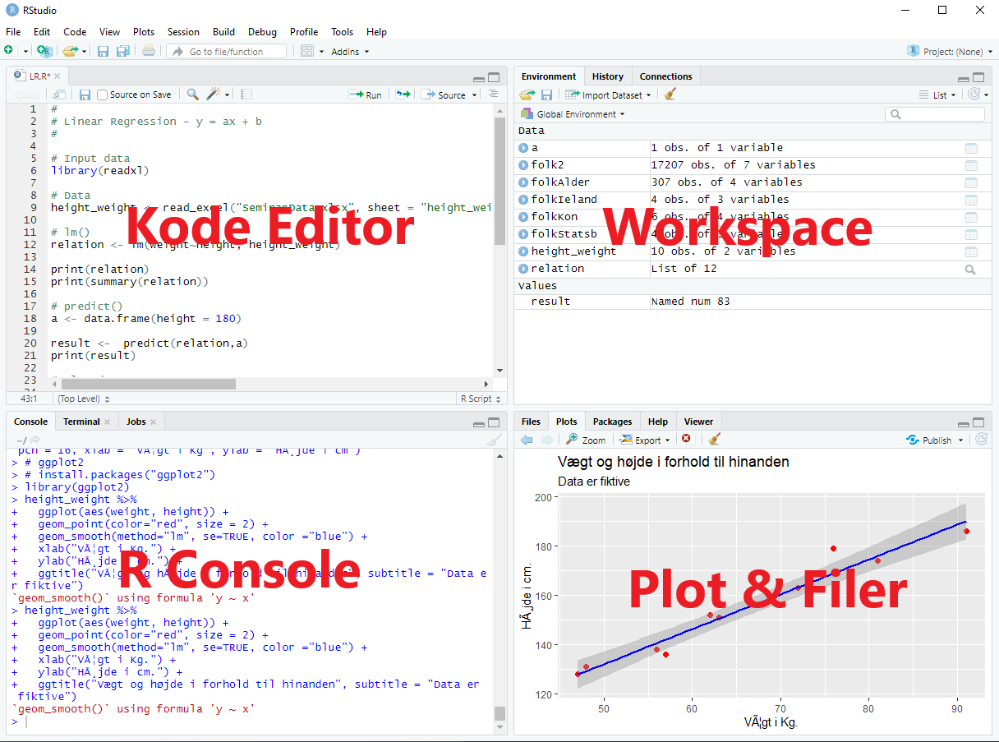
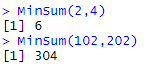

@title[Start]
# R **webinar**
Tue Hellstern

+++
@title[Tue Hellstern]
## Tue Hellstern
<br>
@ol[...](false)
- Undervist i IT siden 1995
- Konsulent opgaver siden 1995
- Virksomheder
- Kursusvirksomheder
- Uddannet på ITU
- Lektor DTU
- Lektor CPH-business
@olend

+++
@title[Agenda]
@snap[north span-50]
## Agenda
@snapend


@snap[west span-50 text-07]
### Dag 1
@ol[...](false)
- Intro R & RStudio
- R syntaks - Intro
- R Pakker
- R Datatyper
- Krav til data
- Import af data
- Basic Plot
@olend
@snapend

@snap[south span-50 text-08 text-blue]
-- Opgave --
@snapend

@snap[east span-50 text-07]
### Dag 2
@ol[...](false)
- Intro Tidyverse
- Import - readr
- Klargøring af data med – tidyr
- Data ”manipulation” med – dplyr
- Plot af data med – ggplot2
- Introduktion til Shiny
@olend
@snapend

+++
@title[Hvorfor R]
@snap[north span-50 text-07]
## Hvorfor R
@snapend

@snap[west span-50 text-06]
* R er et programmeringssprog **fokuseret** på statistisk og grafisk analyse
* Det bruges i **Dtatistisk**, **Dataanalyse** og **Machine Learning**
* R er i øjeblikket det **næst mest** efterspurgte programmeringssprog på Data Science jobmarkedet, kun overgået af Python
@snapend

@snap[east span-50 text-02]

Kilde: [https://www.quora.com/Which-languages-are-important-for-Data-Scientists-in-2019](https://www.quora.com/Which-languages-are-important-for-Data-Scientists-in-2019)
@snapend

+++
@title[Hvorfor R]
## Hvorfor R


+++
@title[Historien om R]
## Historien om R

@ol[... text-08](false)
- R blev udviklet som en implementation af S-programmeringssprog af John Chambers i 1976, på Bell Labs
- R blev viderudviklet af Ross Ihaka og Robert Gentleman ved University of Auckland, New Zealand
- Udviklingen varetages af R Development Core Team
- Projektet blev udtænkt i 1992
- Første version frigivet i 1995
- Stabil betaversion (v1.0) den 29. februar 2000
@olend

+++
@title[Workflow R]


---
@title[Opgave]
## Dag 1

+++
@title[Agenda]
### Agenda - Dag 1

@ol[...](false)
- Intro R & RStudio
- R syntax - Intro
- R Pakker
- R Datatyper
- Krav til data
- Import af data
- Basic Plot
@olend

+++
@title[RStudio]
### RStudio

+++
@title[RStudio - IDE]

@snap[west span-50]
@box[bg-gold text-white rounded box-padding](RStudio er et IDE, Integreret Udviklingsmiljø der gør det nemmere at skrive din R kode)
@snapend

@snap[east span-50]
RStudio fåes i to *versioner:*
@ol[...](false)
- Desktop
- Cloud
@olend
@snapend

@snap[south-west span-50]
www.rstudio.com
@snapend

@snap[south-east span-50]
www.rstudio.cloud
@snapend

+++
@title[IDE - Brugerflade]
### IDE - Brugerflade



+++
@title[Dataimport]
### Dataimport

+++
@title[Typer]
### Import typer

@ol[...](false)
- CSV
- Excel
- Databaser
- SPSS, SAS
- Web
- API – (Typisk via en Pakke)
- Clipboard
@olend

+++
@title[readxl]
### readxl

@snap[north-west span-50 text-black]
**readxl** pakken er en del af tidyverse pakken  
**readxl** gør det nemt og hurtigt at importere data fra Excel
@snapend

@snap[south-west span-100 text-black]
```r zoom-10
install.packages("tidyverse")
install.packages("readxl")

library(readxl)

# Eksempel
read_excel("SeminarData.xlsx", sheet="height_weight")
```
@snapend

@snap[east span-100 text-blue text-10]
@[1-2, zoom-20](Installer enten tidyverse eller readxl)
@[4, zoom-20](Brug paken readxl)
@[7, zoom-12](Henter fra Excel SeminarData.xlsx, ark height_weight)
@snapend

+++
@title[Parameter]

@snap[north-west span-100 text-black]
### readxl parameter
@snapend

@snap[west span-100 text-black]
```r zoom-10
read_excel(
  path,
  sheet = NULL,
  range = NULL,
  col_names = TRUE,
  col_types = NULL,
  na = "",
  trim_ws = TRUE,
  skip = 0,
  n_max = Inf,
  guess_max = min(1000, n_max),
  progress = readxl_progress(),
  .name_repair = "unique"
)
```
@snapend

@snap[east span-100 text-blue text-10]
@[2, zoom-20](Stil til Excel filen)
@[3, zoom-20](Kan være et navn eller index nummer)
@[5, zoom-20](Vil du have Overskrifter med)
@snapend

+++ ?code=code/API_StatistikbankenPitch.R&lang=r zoom-12
@title[API]
### API

@snap[north-west span-100 text-05 text-black]
**API** står for Application Programming Interface, det er for betegner en ”funktion” inden for software, der gør det muligt for flere programmer at arbejder sammen.
@snapend

@snap[south-west span-100 text-blue text-10]
@[1-2, zoom-10](Aktiver pakker - statsDk og tidyverse)
@[4-5, zoom-10](Hent data - Bemærk 1980)
@[7-10, zoom-10](Groupering af data - sum på INDHOLD)
@[13-15, zoom-0](3 Plot, fordelt på HERKOMST )
@snapend

+++
@title[Clipboard]
### Clipboard

@snap[north-west span-100 text-05 text-black]
Det er muligt at bruge **CRTL+C** og så hente fra **Clipboard**
@snapend

```r zoom-12
dataKlip <- readClipboard()

read.table(file="clipboard", sep ="t", header=TRUE)
```

+++
@title[Funktioner]
### Funktioner
indbyggede - user defined

@snap[north-west span-70 text-black text-07]
### R har rigtig mange indbyggede funktioner, f.eks.
@snapend

@ol[text-blue](false)
- abs()
- log()
- exp()
- sqrt()
- .....
@olend


---
@title[Opgave]
@snap[north-west span-70 text-black text-07]
## Opgave
@snapend
Her er en lille opgave som du kan løse til næste gang. 

+++?color=white
@title[Funktion – SUM to tal]
@snap[north-west span-70 text-black text-07]
sd
@snapend

@snap[west span-50]

@snapend


---
@title[Dag 2]
## Dag 2

+++
@title[Agenda - Dag 2]
### Dag 2 - Agenda

- Intro Tidyverse
- Import - readr
- Klargøring af data med – tidyr
- Data ”manipulation” med – dplyr
- Plot af data med – ggplot2
- Introduktion til Shiny


