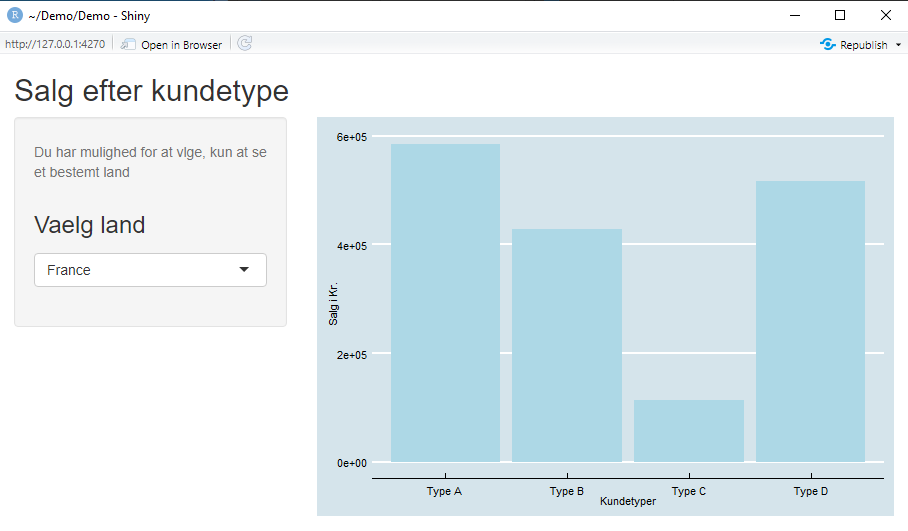

# R **webinar**
## Dag 2

Tue Hellstern

---
@title[Agenda]
## Agenda

@ol[...](false)
- Intro Tidyverse
- Import - readr
- Klargøring af data med – tidyr
- Data ”manipulation” med – dplyr
- Plot af data med – ggplot2
- Introduktion til Shiny
@olend


---
@title[Shiny]
## Shiny

+++
@title[Kode eksempel]

@snap[north-west span-70 text-black text-07]
**Shiny kode eksempel**
@snapend

@snap[east span-55 text-black text-07]
ui.R
```r zoom-05
library(readxl)
library(ggplot2)
library(tidyverse)

salg <- read_excel("SalgsData.xlsx", sheet = "salgs_data")

# Use a fluid Bootstrap layout
fluidPage(    
    
    # Side overskrift
    titlePanel("Salg efter kundetype"),
    
    # Opret sidebar
    sidebarLayout(      
        
        # Sidebar Input
        sidebarPanel(helpText("Du har mulighed for at vælge, kun at se et bestemt land"), 
                     
                     selectInput("valgtland", h3("Vaelg land"), 
                                 choices = salg$Country, 
                                 selected = 1)),
        
        # Placering af barplot
        mainPanel(
            plotOutput("salgplot")  
        )
        
    )
)
```
@snapend

@snap[west span-45 text-black text-07]
server.R
```r zoom-05
library(readxl)
library(ggplot2)
library(tidyverse)
library(ggthemes)

salg <- read_excel("SalgsData.xlsx", sheet = "salgs_data")

# Input/Out-put Shiny app
function(input, output) {

  
  output$selected_var <- renderText({ 
    paste("Valg af land", input$valgtLand)
  })
    
  # Placering af plot
  output$salgplot <- renderPlot({
    
    # Opret barplot, inkl filter
    dplyr::filter(salg, Country == input$valgtland) %>%
      ggplot(aes(x=CompanyType, y=Total)) +
      geom_bar(stat="identity", fill="lightblue") + 
      ylab("Salg i Kr.") +
      xlab("Kundetyper") + 
      theme_economist()
  })
}
```
@snapend

@snap[south-east span-25]

@snapend